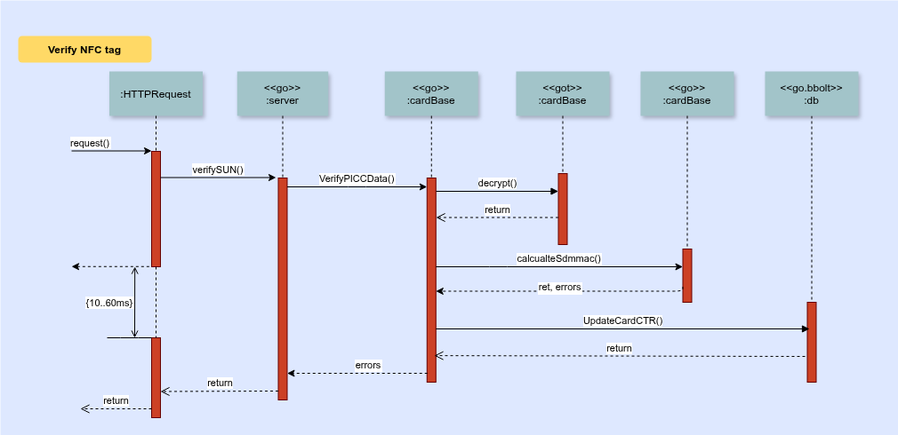

Server important function
=========================
By Kevin Mak, document create and update at 2/12/2024

## The folder of `card`

This folder included the main technology of NFC encryption. 

File description:
- `card_admin.go`- Manage WebUI and API admin login sessions. 
- `card_db.go`- Business logic of control all NFC tag info, include save passkey, model linking and access control.
- `db_types.go`- Interface define for manage data structure
- `lrp.go` - Leakage Resilient Primitive (LRP) Specification implementation. NTAG 424 DNA supported advantage encrypt format.
- `verify_base.go` - NFC tag verification implementation. Currently supported AES and LRP auto detect to decrypt.

Each script file are include unit test to verify code quality.

### Verify sequence diagram

Following diagram have simplified deep function


On this diagram all step are required success to run next step, else with return a bad result request to client.

Start from those URL entry
```go
// server_card_verify.go
app.Get("/verify/sun", verifySUN)
app.Post("/verify/sun", verifySUN)
```

When got request then will trigger this handler
```go
func verifySUN(ctx iris.Context) {
    // verify code here...
}
```

Run follow function with PICC and CMAC 
```go
cardBase.VerifyPICCData(bPicc, bCmac, cardDB, appdebug)
```

Decrypt PICC with `metaKey` to get `uid`, `ctr`. By `uid` to find "card key" in card database which used on encryption with targeted NFC tag.

When "card key" got will run follow function the do final verify. The function will result as NFC tag mac address.
```go
calculateSdmMac(cardFileKey, sdmmacBuf.Bytes(), lrp)
```

When decrypt tag mac address are same do CTR update and return HTTP request result to client
```go
db.UpdateCardCTR(uid, ctrBuf, s)
```